# Phosphor

A bold, high-contrast theme family for Zed. Built around a dark terminal aesthetic with electric syntax colors that refuse to be subtle.

Phosphor comes in six variants across two color families: the green-grounded **Default/Void/Soft** variants, and the fire-toned **Ember** variants - each available on either the classic green background or the purple-tinted **Dusk** background.

---

| Variant | Background | Character |
| --- | --- | --- |
| Default | `#082408` | The original - electric yellow, cyan, magenta on deep green |
| Void | `#010801` | Default palette on a near-black background |
| Soft | `#082408` | Default background with muted, desaturated syntax colors |
| Dusk | `#0D0818` | Default syntax palette on a deep violet background |
| Ember | `#082408` | Fire-toned - orange keywords, red strings, gold constants on green |
| Ember Dusk | `#0D0818` | Ember palette on the Dusk background |

---

## Color Palettes

### Default & Void
> Void shares the same syntax palette as Default - only the background color differs.

| Role | Color |
| --- | --- |
|Background (Default) | `#082408` |
| Background (Void) | `#010801` |
| Keywords | `#FFE000` |
| Strings | `#00E5FF` |
| Properties | `#FF2DD4` |
| Constants | `#7FFFB2` |
| Functions | `#CCFF00` |

### Soft

| Role | Color |
| --- | --- |
| Background | `#082408` |
| Keywords | `#D4A800` |
| Strings | `#00B5CC` |
| Properties | `#CC1AAB` |
| Constants | `#66CCAA` |
| Functions | `#A3CC00` |

### Dusk
> Dusk shares the same syntax palette as Default - only the background color differs.

| Role | Color |
| --- | --- |
| Background | `#0D0818` |
| Keywords | `#FFE000` |
| Strings | `#00E5FF` |
| Properties | `#FF2DD4` |
| Constants | `#7FFFB2` |
| Functions | `#CCFF00` |

### Ember & Ember Dusk
> Ember Dusk shares the same syntax palette as Ember - only the background color differs.

| Role | Color |
| --- | --- |
| Background (Ember) | `#082408` |
| Background (Ember Dusk) | `#0D0818` |
| Keywords | `#FF6600` |
| Strings | `#FF1A1A` |
| Properties | `#FFFF66` |
| Constants | `#FFD740` |
| Functions | `#FFAA00` |

---

## Screenshots

Default

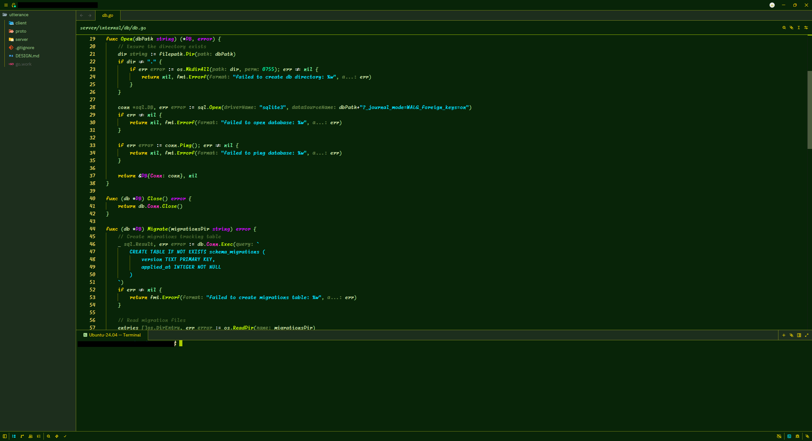
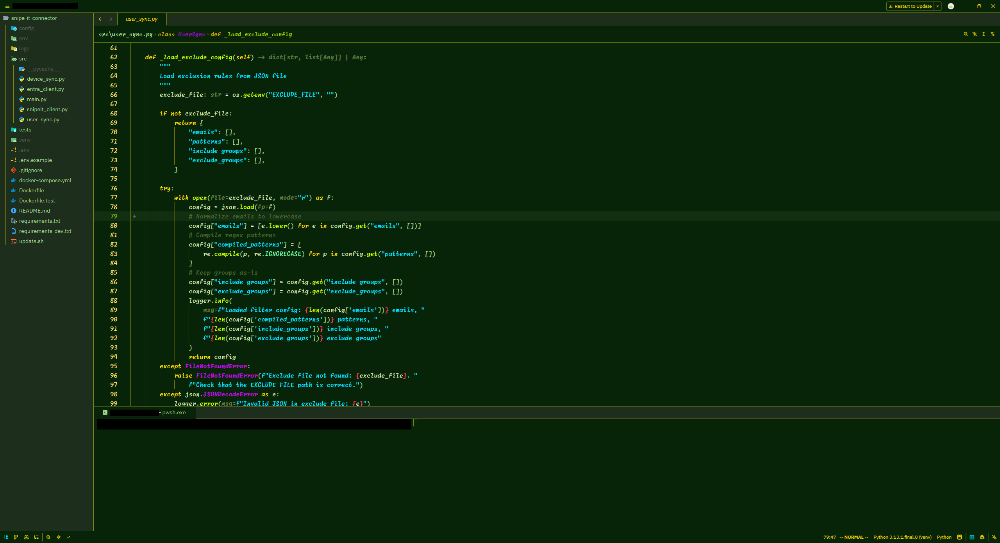
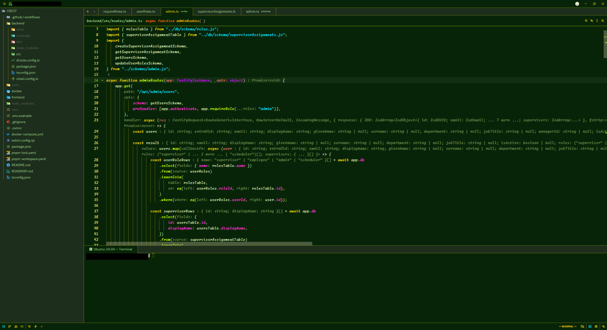

Void

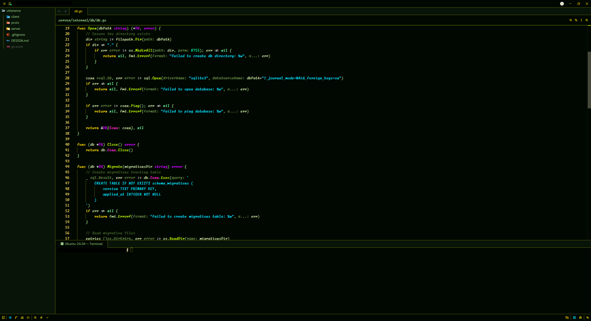
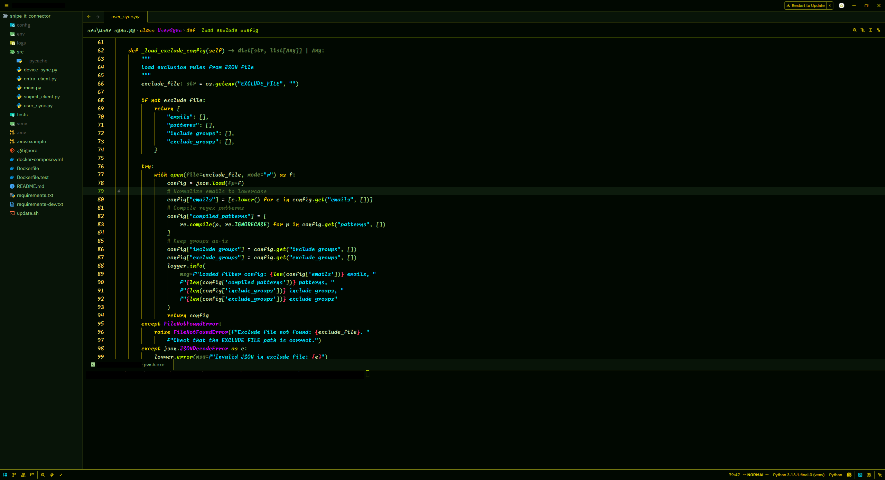
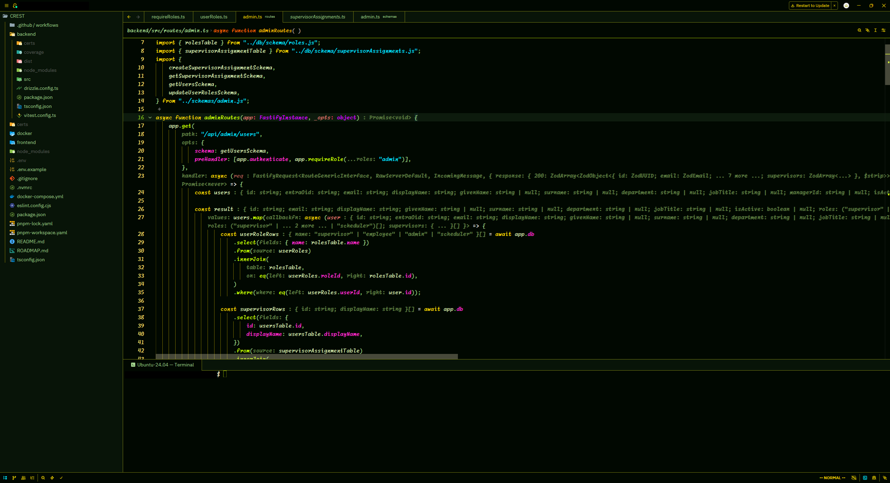

Soft

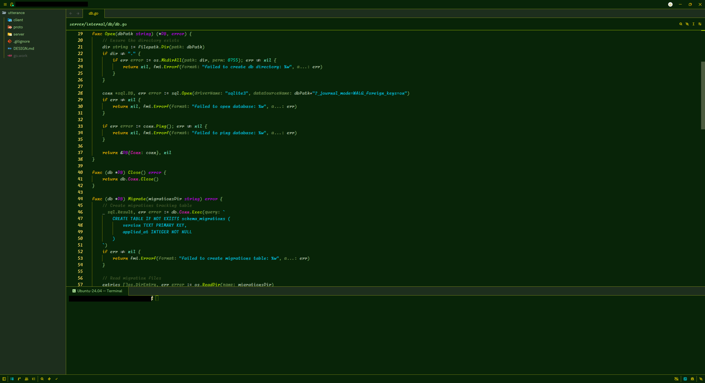
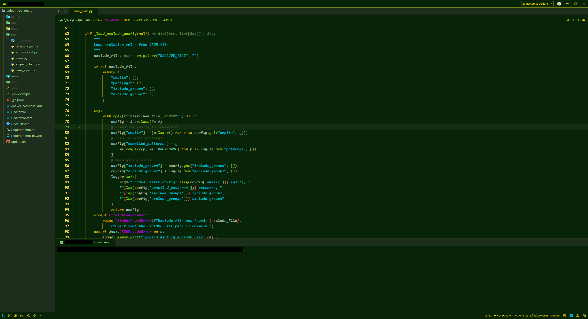
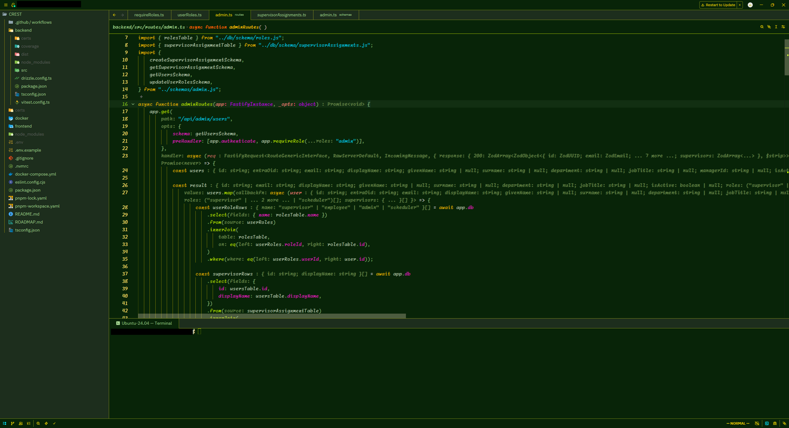

Dusk

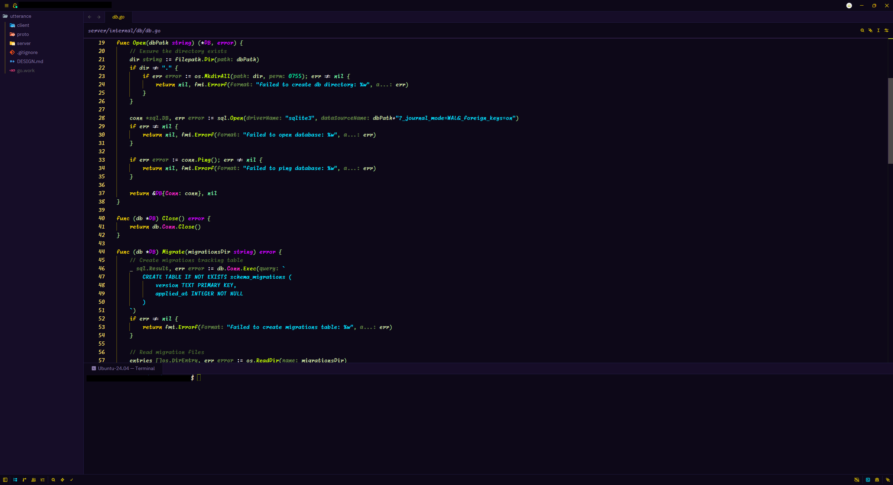
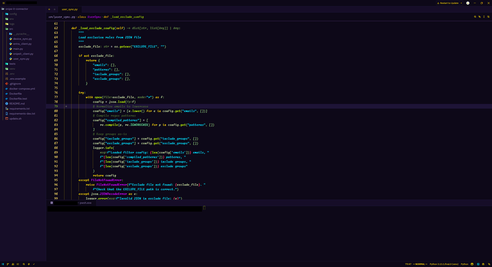
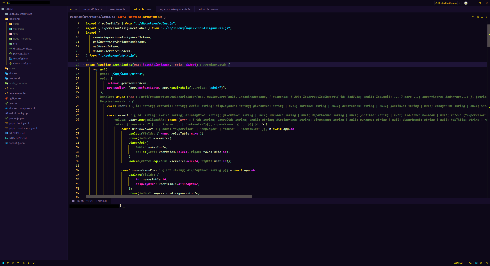

Ember

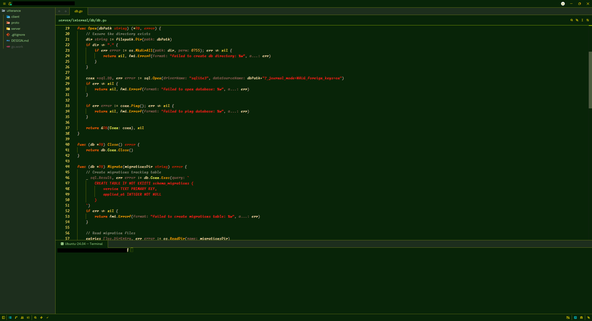
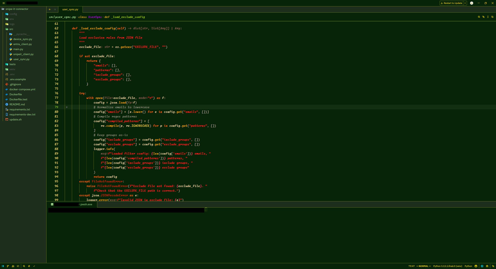
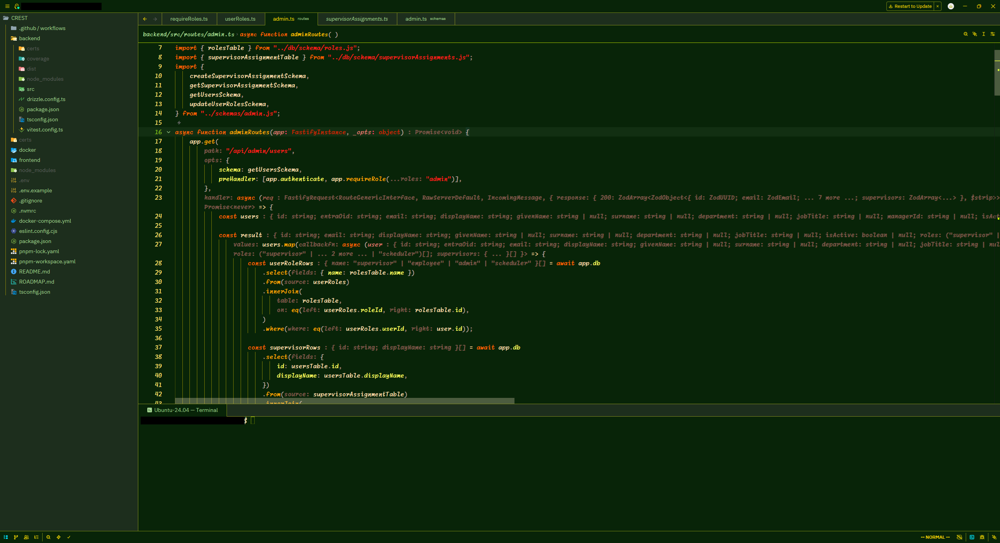

Ember Dusk

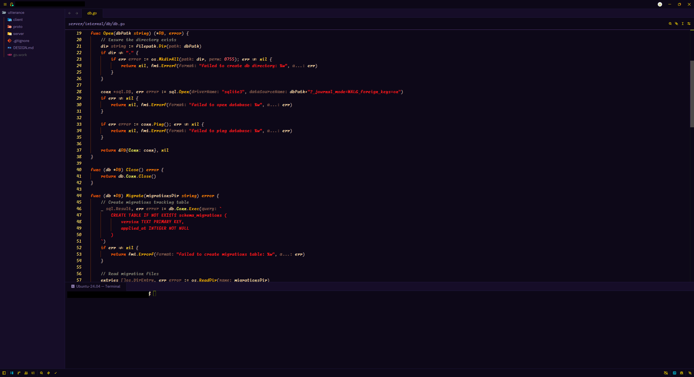
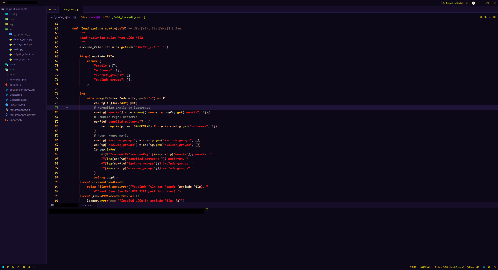
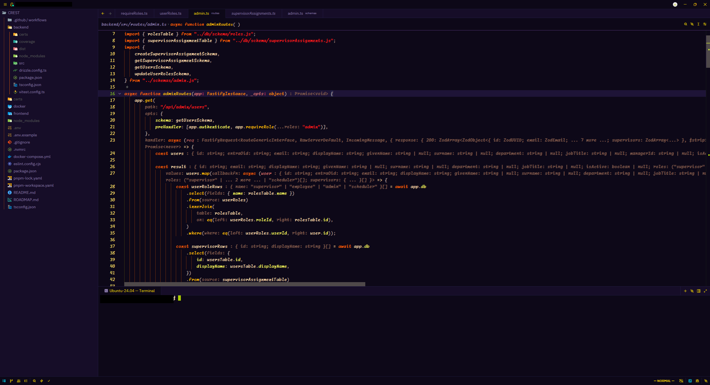

