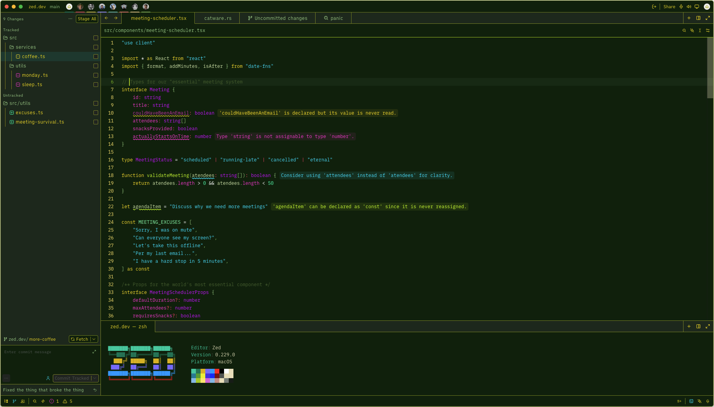
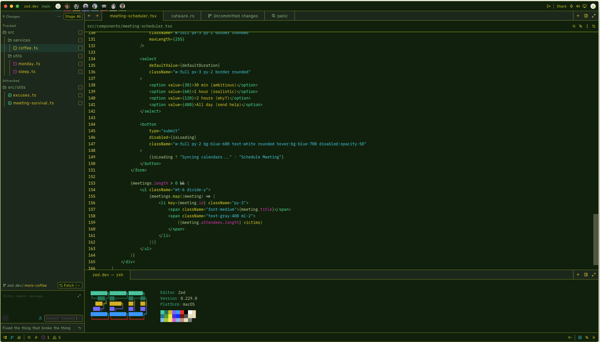
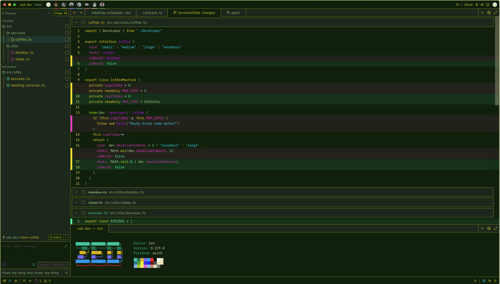
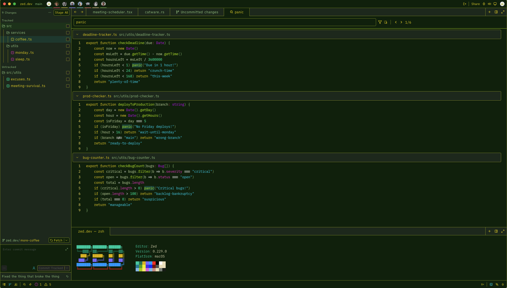
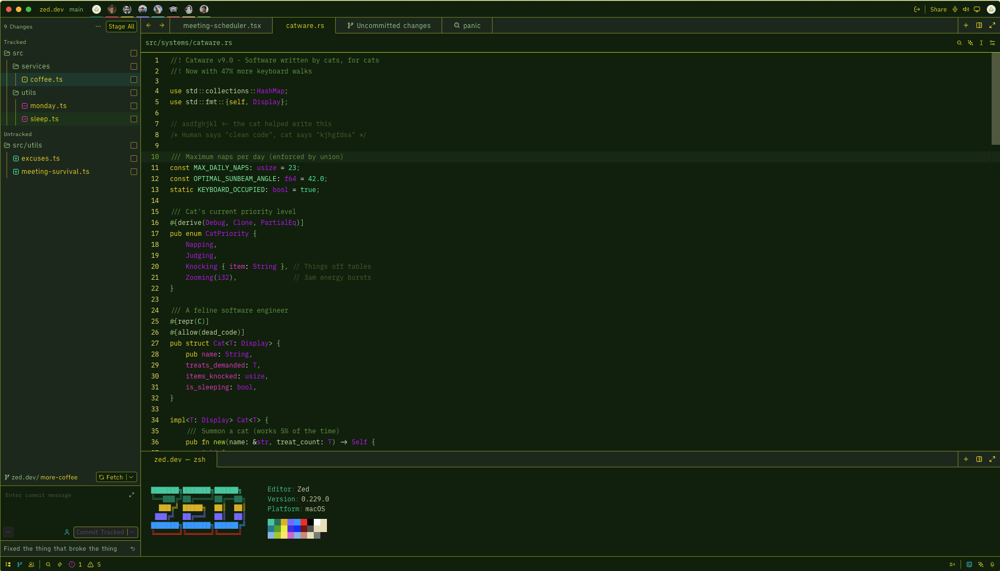

## Phosphor
The primary philosophy behind Phosphor is to be bold, punchy, and loud. Its meant to stand out.  
With that said; Phosphor is a dark green terminal-inspired theme with electric yellow keywords, cyan strings, magenta properties, and mint green constants.

## Color Palette
- **Background:** #082408
- **Text:** #FFE000
- **Accent:** #00E5FF

## Screenshot Examples

### Theme overall view
TypeScript file showing inline type errors and a color palette overview, as well as showing JSX markup with nested tags and string attributes.

### Git diff view
Showing added/removed lines across a TypeScript class

### Project-wide search view
Shows a project-wide search for "panic" across three TypeScript files

### Rust example
Rust file to show syntax highlighting across enums, structs, attributes, and doc comments

